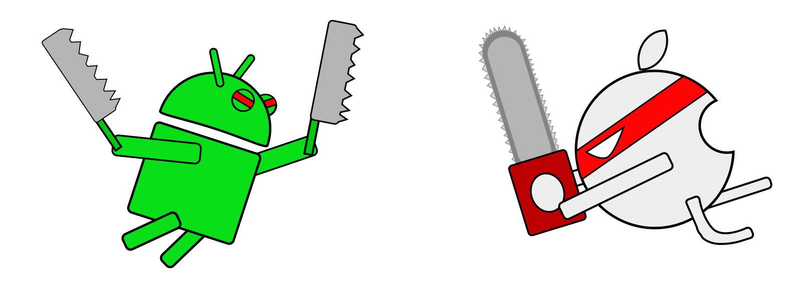

#【iOS-Android开发对比】之 APP入口



[图片 Android vs iOS]

>作者：TindleWei   
>图片来自：TindleWei 画的  
>转载请说明出处：

提纲

1. 对比分析iOS,Android的入口，

2. iOS,Android的界面单元

3. 为什么要有那样的生命周期

4. 继承和抽象类怎么写，例如工厂模式

5. 对象的强弱，iOS的特色


## 程序入口 (Entry Point)
<br/>
**#首先来看iOS应用的入口：**

```
int main(int argc, char * argv[])
{
    @autoreleasepool {
        return UIApplicationMain(argc, argv, nil, NSStringFromClass([AppDelegate class]));
    } 
}
```
和所有C程序一样，main函数是Objective-C程序的入口。虽然这个main方法返回 int，但它并不会真正返回。它会一直存在于内存中，直到用户或者系统将其强制终止.

上面的`UIApplicationMain`其来自 `UIKit`，是一个非常重要的函数。

说一下参数，前两个参数大家都懂。  

第三个参数，是UIApplication类名或者是其子类名，如果是nil，则默认使用UIApplication类名。  

第四个参数，是AppDelegate类作为应用的委托对象，用来监听应用生命周期相关的委托方法。

这个`UIApplication`的核心作用是提供了iOS程序运行期间的控制和协作工作。它创建了App的几个核心对象如： UIApplicationDelegate UIWindow, UIView，来处理一下过程：

1. 程序入口main函数创建UIApplication实例和UIApplication代理实例。

2. 从可用Storyboard文件加载用户界面

3. 调用AppDelegate自定义代码来做一些初始化设置

4. 将app放入Main Run Loop环境中来响应和处理与用户交互产生的事件


这个UIApplication对象在启动时就设置 `Main Run Loop`,并且使用它来处理事件和更新基于view的界面, Main Run Loop就是应用程序的主线程。


[图片 iOS, swift, Android举牌]

<br/>
**说说Swift的入口：**

在Swift语言当中，编译器不会再去寻找 main 函数作为程序的入口，而是一个`main.swift`文件.  
该文件中的第一行代码就默认为是程序的入口, 可以添加如下代码：

```
UIApplicationMain(C_ARGC, C_ARGV, nil, 
    NSStringFromClass(AppDelegate))
```
没错，就是之前提到的`UIApplicationMain`。这里 C_ARGC, C_ARGV 全局变量 就是main函数中的
argc, argv。

另外，可以在Swift文件中添加 `@UIApplicationMain` 标签注明项目入口。这样做会让编译器忽略main.swift入口文件，而将标注有@UIApplicationMain标签的文件当做入口文件。


<br/>
**#再来看看Android的：**

**Android程序你找不到显式的main方法**

尽管java也有main方法，可Android似乎却找不到main。

对于这个问题，有很多解释。 

Stackoverflow上有解释说没有main是因为不需要main,系统生成activity并调用其方法,应用默认启动已经把main代替了,因此不需要用main方法。

那么程序的入口在哪里？ 我们从`Application`开始看.

每个Android程序的包中，都有一个manifest文件声明了它的组件，我们可以看到如下代码：

```
<manifest  ...
	<application  ...
		<activity android:name=".MainActivity" android:label="@string/app_name"> 
            <intent-filter> 
                <action android:name="android.intent.action.MAIN" /> 
                <category android:name="android.intent.category.LAUNCHER" /> 
            </intent-filter> 
		</activity> 
	</application>
</manifest>
```

在这个xml写成的manifest文件中，`<application/>` 标签在最外层。其中，这个标记了android.intent.category.LAUNCHER 的 `<activity/>` 就是程序启动的默认界面。但是它们不是真正的入口。

**Android应用程序的真正入口为 `ActivityThread.main`方法**

这是一个隐式的入口，代码做了一定简化如下：

```
public static void main(String[] args) {  
     //一些检测预设值...  
     Looper.prepareMainLooper();// 创建消息循环Looper  
     ActivityThread thread = new ActivityThread();  
     thread.attach(false);  
     if (sMainThreadHandler == null) {  
         sMainThreadHandler = thread.getHandler(); // UI线程的Handler  
     }  
     AsyncTask.init();  
     Looper.loop();   // 执行消息循环  
     throw new RuntimeException("Main thread loop unexpectedly exited");  
 }  
```

**#深入一下：**

继承关系：

```
java.lang.Object
   ↳	android.content.Context
 	   ↳	android.content.ContextWrapper
 	 	   ↳	android.app.Application
```


-------


## 界面元素

下来说最基本的界面元素，Android是`Activity`,iOS是 `UIViewController`.

#### 先介绍Android 

Activity是怎么在屏幕上显示出来的?

简单来说，Activity中调用setContentView后，将从系统中获取一块Surface从而的到一个画布Canvas,接着调用View的draw开始绘图。

具体绝对非常复杂:  
从Activity的最初启动开始，在`ActivityThread`中，有个函数`handleLaunchActivity`,它就是创建Activity的地方。

```
private final void handleLaunchActivity(ActivityRecord r, Intent customIntent) {
       //①performLaunchActivity返回一个Activity
       Activity a = performLaunchActivity(r, customIntent);
       ...
       
       //②调用handleResumeActivity
       handleResumeActivity(r.token, false, r.isForward);
       ...
       }
```

里面有两个关键函数 ：

+ `performLaunchActivity`会根据Java反射以Activity类名创建一个Activity,并调用Activity的onCreate()方法。

+ `handleResumeActivity`使用WindowManager调用ViewRoot, 这个ViewRoot是显示系统中最为关键，他继承自Handler,实现了一些View的接口。  
在ViewRoot中,有个Surface是一个Java/JNI对象,它相当UI的画布，它会生成一个Canvas,从而实现View的draw方法。
最后ViewRoot会调用requestLayout()方法来显示UI。

这里画个图来说明下：


---------

### 接下来讲关于iOS的


Android的Activity和Fragment是最基本的界面组成，而IOS是UIViewController。几乎所有的View和空间都会放在Activity和UIViewController中。

要说iOS的界面单元，有 UIScreen, UIView, UIWindow, UIViewController.

Android应用程序窗口的UI渲染过程可以分为测量、布局和绘制三个阶段。

Measure()->Layout()->Draw()

递归（深度优先）确定所有视图的大小（高、宽）
布局：递归（深度优先）确定所有视图的位置（左上角坐标）
绘制：在画布canvas上绘制应用程序窗口所有的视图

测量、布局没有太多要说的，这里要着重说一下绘制。Android目前有两种绘制模型：基于软件的绘制模型和硬件加速的绘制模型（从Android 3.0开始全面支持）。
 
在基于软件的绘制模型下，CPU主导绘图，视图按照两个步骤绘制：
1.      让View层次结构失效
2.      绘制View层次结构

在之上有不少扩展的:  

`Android:`  FragmentActivity, AppCompatActivity

`IOS:` UITableViewController, UICollectionViewController

我们对比一下继承关系:
  
`Android:` `Activity->ContextThemeWrapper->ContextWrapper->Context` 
 
`iOS:` `UIViewController->UIResponder->NSObject`

iOS几乎所有的基类都是NSObject。  
Android中也有Object,Object一般作为Model层对象的基类。

Java实际上任何对象都是直接或间接继承自Object，写extends Object和不写extends是等价的。
因此 Android和iOS的对象, 本质上都是从顶级的Object继承来的。  
*Amazing~*

## 生命周期

这方面资料很多,我简单说一下:

Android的Activity, `onCreate()` 中初始化操作, `onResume()`中可以加一些改变界面和状态的操作;

IOS的UIViewController, `-viewDidLoad ` 中初始化操作, `-viewWillAppear` 中可以加一些改变界面和状态的操作;

对比一下：

> `Activity:` onCreate() --> onStart() --> onResume( )--> `运行态` --> onPause() --> onStop() --> onDestroy()

> `UIViewController:` -viewDidLoad --> -viewWillAppear --> -viewDidAppear --> `运行态` --> -viewWillDisappear --> -viewDidDisappear

这里补充一个Android的  
> `Fragment:`** *onAttach()* --> onCreate() --> *onCreateView()* --> *onActivityCreate()* --> onStart() --> onResume( )--> `运行态` --> onPause() --> onStop() --> *onDestroyView()* --> onDestroy() --> *onDetach()*

Android与IOS都使用 **堆栈** 的数据结构 存储Activity和UIViewController.

`Android`关于Activity的堆栈, 可以搜索`taskAffinity`和`launchMode`。同一应用所有Activity具有相同的亲和性(taskAffinity)，可通过Itent FLAG设置，也可在AndroidManifest中设置.

`IOS`中的UINavigationController通过堆栈来UIViewController.


## 界面跳转与传值

`Android:` Activity可以使用Intent，Fragment使用Bundle。 对于界面回调传值，通过startActivityForResult()启动和onActivityResult()接收。

`IOS:` 在初始化UIViewController对象时，直接给对象中的变量赋值。 对于界面回调传值，可以自定义接口(Delegate),也可以使用通知(Notification)


## 结构类型
 
<h4>类代码</h4>

```
//Android
A.java Class A extends B implements C
```

```
//IOS
A.h @interface A : B 
A.m @implementation A <C>
```
		
--
<h4>强引用和弱引用</h4>


Android:  
>有四种引用类型，强引用(StrongReference),软引用(SoftReference),弱引用(WeakReference),虚引用(Phantom Reference)。  
一般创建的对象都是强引用。所以当内存空间不足时，Java虚拟机宁愿抛出OOM异常，也不会随意回收强引用的对象。  
对于软引用，内存空间足够，垃圾回收器就不会回收它，可以做图片的缓存。  

>对于弱应用，使用场景例如：在Activity中使用Handler时，一方面需要将其定义为静态内部类形式，这样可以使其与外部类（Activity）解耦，不再持有外部类的引用，同时由于Handler中的handlerMessage一般都会多少需要访问或修改Activity的属性，此时，需要在Handler内部定义指向此Activity的WeakReference，使其不会影响到Activity的内存回收同时，可以在正常情况下访问到Activity的属性。


IOS:  
>使用__weak, __strong用来修饰变量，默认声明一个对象 __strong。  
在强引用中，有时会出现循环引用的情况，这时就需要弱引用来帮忙（__weak）。  
强引用持有对象，弱引用不持有对象。  
强引用可以释放对象，但弱引用不可以，因为弱引用不持有对象，当弱引用指向一个强引用所持有的对象时，当强引用将对象释放掉后，弱引用会自动的被赋值为nil，即弱引用会自动的指向nil。

--
<h4>私有和公有</h4>

IOS中有`-``+`方法，`-`相当于Android中的private,   
`+`相当于Android中的public static。  

对于全局变量，IOS是放在AppDelegate中或者使用#define声明在.h中。  
Android同样，放在Application中 或者类中使用public static。  
当然，都可以使用单例类。


## 基本控件

对比一些常用的

Android  | IOS
------------- | -------------
TextView  | UILabel
TextEdit  | UITextField UITextView
ImageView | UIImageView
Button    | UIButton
Switch    | UISwitch
ListView  | TableView 
GridView  | CollectionView

对比一下继承：
Android Views -> View  
IOS Views -> UIView -> UIResponder -> NSObject

Java实际上任何对象都是直接或间接继承自Object，写extends Object和不写extends是等价的。
因此 Android和IOS的对象, 本质上都是从顶级的Object继承来的。*Amazing~*


## 关于继承和抽象类


## App启动的堆栈原理


## 如何写工厂模式


## App的启动程序入口

--
  
文章和代码一样，也需要不断去梳理，不断迭代。  

**参考**

iOS

[http://www.jianshu.com/p/aa50e5350852](http://www.jianshu.com/p/aa50e5350852)

[http://www.cnblogs.com/ydhliphonedev/archive/2012/07/30/2615801.html](http://www.cnblogs.com/ydhliphonedev/archive/2012/07/30/2615801.html)

[http://swifter.tips/uiapplicationmain/](http://swifter.tips/uiapplicationmain/)

[http://blog.ibireme.com/2015/05/18/runloop/](http://blog.ibireme.com/2015/05/18/runloop/)

[http://swifter.tips/uiapplicationmain/](http://swifter.tips/uiapplicationmain/)

Android

[http://www.cnblogs.com/lwbqqyumidi/p/4151833.html](http://www.cnblogs.com/lwbqqyumidi/p/4151833.html)

[https://sites.google.com/site/terrylai14/home/android-context-yuan-li](https://sites.google.com/site/terrylai14/home/android-context-yuan-li)

[http://blog.csdn.net/chenzheng_java/article/details/6215986](http://blog.csdn.net/chenzheng_java/article/details/6215986)

[http://blog.csdn.net/chenzheng_java/article/details/6216621](http://blog.csdn.net/chenzheng_java/article/details/6216621)

[http://blog.csdn.net/bboyfeiyu/article/details/38555547](http://blog.csdn.net/bboyfeiyu/article/details/38555547)

[http://blog.csdn.net/innost/article/details/47208337](http://blog.csdn.net/innost/article/details/47208337)

## 其他

Android 程序入口 application onCreate()后都做了什么，这里有个歪果仁打印出了onCreate后堆栈显示的日志：

```
MainActivity.onCreate(Bundle) line: 12  
Instrumentation.callActivityOnCreate(Activity, Bundle) line: 1047   
ActivityThread.performLaunchActivity(ActivityThread$ActivityRecord, Intent) line: 2627  
ActivityThread.handleLaunchActivity(ActivityThread$ActivityRecord, Intent) line: 2679   
ActivityThread.access$2300(ActivityThread, ActivityThread$ActivityRecord, Intent) line: 125 
ActivityThread$H.handleMessage(Message) line: 2033  
ActivityThread$H(Handler).dispatchMessage(Message) line: 99 
Looper.loop() line: 123 
ActivityThread.main(String[]) line: 4627    
Method.invokeNative(Object, Object[], Class, Class[], Class, int, boolean) line: not available [native method]  
Method.invoke(Object, Object...) line: 521  
ZygoteInit$MethodAndArgsCaller.run() line: 868  
ZygoteInit.main(String[]) line: 626 
NativeStart.main(String[]) line: not available [native method] 
```

Android的最底层是`Linux Kernel`, iOS是`XNU Kernel`,它们有什么区别呢？
