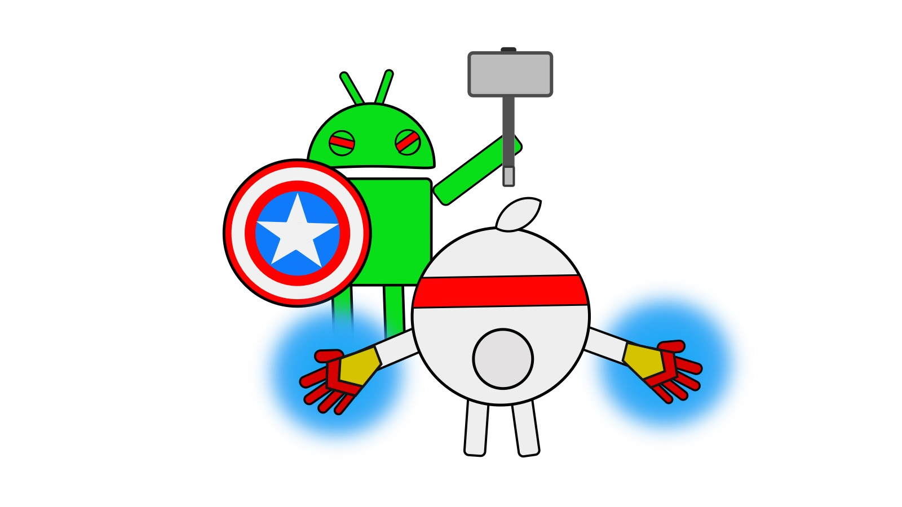
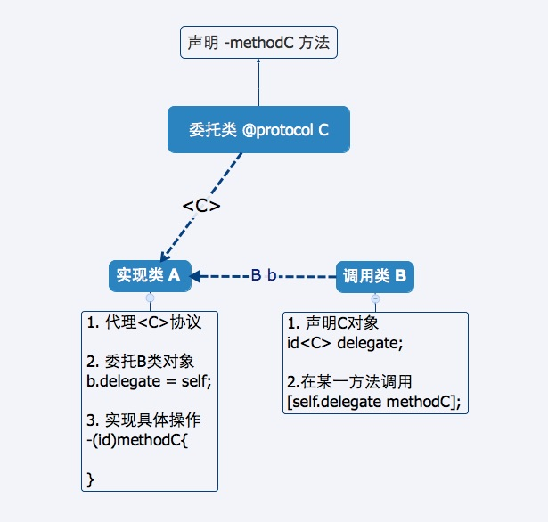
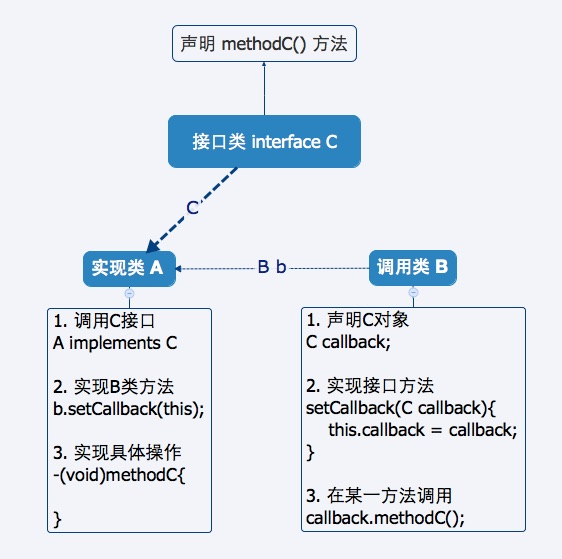

## 【Android与IOS开发对比系列】之 回调机制



Android和IOS的回调的实现原理基本相同，只是具体命名不同而已。  

本文将总结 IOS的Delegate和block, Android的interface和Handler.

IOS 协议
-----------

委托`Delegate`是协议的一种，通过`@protocol`声明。委托类的作用，一是传值，二是传事件。





#### 举个例子：
要实现选相册图片, 依据图:   
C类是委托类，定义了一个传值方法。   
A类显示一个图片，点击按钮，进入B类选取图片。  
当在B类选完图片，将实现methodC:para方法。  
返回A, 执行回调方法:  
methodC:para{
	//get imageView Url from para
}  


Android 接口
-----------

回调`Callback`使用接口来实现，通过实现`interface`类。



#### 举个例子：
同样可以遵循IOS的例子，  
那再举个别的：要实现点击事件的调用  
C类是接口类， View.OnClickListener,  
A是一个Activity，B是一个Button,  
初始化A, Button btn,  
btn.setOnClickListener(this),  
View.OnClickListener(){
}  
而B则在onTouch事件中调用View.onClickListener  
怎么样，很熟悉吧。


IOS block
------------
IOS有一个**block** 机制 是Android没有，超级好用。

下面举三种代码讲解：

1.第一种：

```
typedef void (^ArrayResultBlock)(NSArray *objects, NSError *error);

[self queryByStory:self.story callback:^(NSArray *objects, NSError *error) {

}];

-(void)queryByStory:(Story *)story callback:(ArrayResultBlock)block{
    [_dbQueue inDatabase:^(FMDatabase *db) {

        if (block) {
            block(result, nil);
        }
    }];
}
```

2.第二种: 

```
	VC *vc = [VC new];
    vc.typeBlock = ^(NSString * result){
        //do anything
    };

 	@property (nonatomic, copy) void(^typeBlock)(NSString *);

	- (void)method{
    	if(_typeBlock){
        	_typeBlock(@"end data restored");
    	}
```


3.第三种: block嵌套

```
typedef void (^CommonResultBlock)(BOOL successed);

[self saveStory:^(BOOL successed) {
        [self saveMore:^(BOOL successed) {
        }];
    }];

-(void) saveStory:(CommonResultBlock)block{

    if(block){
        block(YES);
    }

}

-(void) saveMore:(CommonResultBlock)block{

    if(block){
        block(YES);
    }
}
```


Android Handler
------------
如果说 block只有IOS有，Android肯定不服了，因为Android有 Handler。

其实，Handler和block的作用是一样的，只不过原理上完全不是一个概念。


下面代码举一个Handler的例子：

```
private Handler handler = new Handler() {
 
        @Override
        public void handleMessage(Message msg) {
            if (msg.what == UPDATE) {
                tv.setText(String.valueOf(msg.obj));
            }
            super.handleMessage(msg);
        }
    };
    
```

```
new Thread() {
            @Override
            public void run() {
                try {
                        Message msg = new Message();
                        msg.what = UPDATE;
                        msg.obj = "更新后的值：" + i;
                        handler.sendMessage(msg);
                    }
                } catch (InterruptedException e) {
                    e.printStackTrace();
                }
            }
        }.start();
```

当然，Handler也可想block那样嵌套使用。


-----------
另外：  
如有什么观点和问题，欢迎讨论和指正。


另外补充

block的数据结构和runtime是开源的,苹果提供了在线的代码查看方式，其中包含了很多示例和文档说明

在Object-C中如何写Block

本地变量:  
`returnType (^blockName)(parameterTypes) = ^returnType(parameters){...};`

Property:  
`@property (nonatomic, copy) returnType (^blockName)(parameterTypes);`

Method Parameter:  
`-(void)someMethodBlock:(retrunType (^)(parameterTypes))blockName;`

Argument to A Method Call:  
`[someObject someMethodBlock:^returnType (parameters) {...}];`

Typedef:
`typedef returnType (^TypeName)(parameterTypes);`
`TypeName blockName = ^returnType(parameters) {...};`


参考：

[http://fuckingblocksyntax.com/](http://fuckingblocksyntax.com/)


  