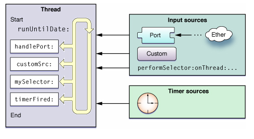
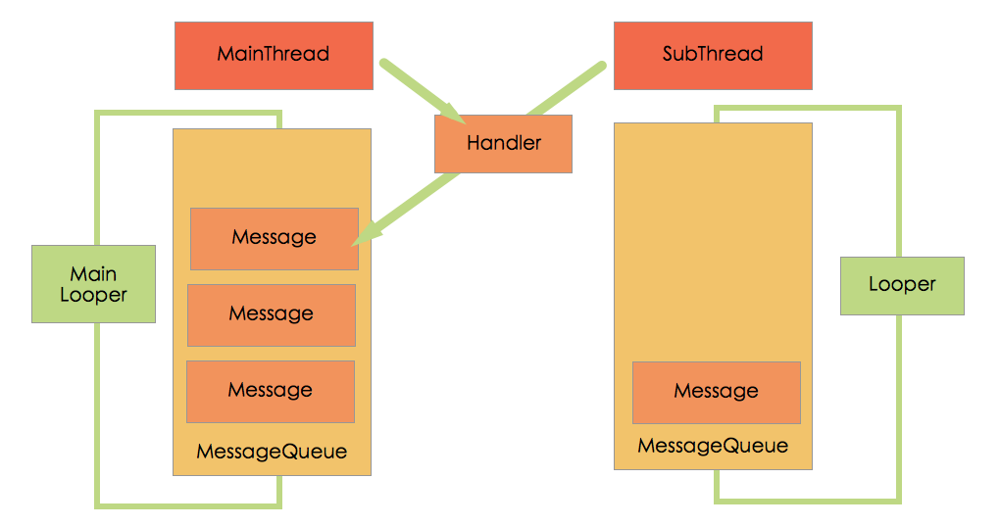

# iOS-Android开发对比系列——多线程


这篇文章并不是为了列出iOS和Android多线程的几种实现方式，因为这样的内容随便哪里都能搜到。我这里主要是探讨它们为什么要这么设计多线程以及它们实现方式的异同。

提纲:

1. 苹果设计多线程的思路， 谷歌的思路。

2. 串行与并行的多线程方式 （GCD与Handler)

3. NSThread和Thread的对比

4. 线程池的设计

5. 锁的设计


## 多线程的设计思路

手机系统的运行原理和电脑系统是类似的。一个APP的启动就相当于一个程序开启了一个进程，而一个进程至少要启动一个线程，这个线程就是App的主线程。

线程也有不同的类型，有的像一条直线，从一个点到另一个点; 有的像一条圆环，不断循环，直到将它切断。App启动而产生的主线程，就相当于一个圆环，在iOS中叫做RunLoop, 在Android中叫做Looper。

先看苹果，RunLoop是线程基础架构的一部分，Cocoa和CoreFundation都提供了RunLoop对象来配置和管理线程。每个线程，包括程序的主线程都有与之对应的RunLoop对象，只是主线程的RunLoop是默认启动的，而对于其他线程，RunLoop默认是没有启动的。

对于安卓，思路是一模一样的。Android为每一线程都提供了Looper对象来管理该线程的消息队列，主线程的Looper默认是启动的，而子线程一般都会调用Looper.prepare()和Looper.loop()来创建消息队列和进入消息循环。

<br/>    

下面举图来说明这个问题
<br/> 


<h6 align = "center">[iOS] Looper&MessageQueue&Hanlder的关系图</h6>

<br/> 

  
<h6 align = "center">[Android] Looper&Hanlder&MessageQueue的关系图</h6>


它们的概念和思路是一样的，但具体的实现过程略有不同。


对于iOS和Android,都规定了要更新UI只能在主线程中实现。UI的现实都是通过屏幕的不断刷帧，

说点细节的东西


Handler相当于一个消息处理器
	在我们在子线程中执行完耗时操作后很多情况下我们需要更新UI，但我们都知道，不能在子线程中更新UI。此时最常用的手段就是通过Handler将一个消息post到UI线程中，然后再在Handler的handleMessage方法中进行处理。但是有一个点要注意，那就是该Handler必须在主线程中创建！
	
不同的线程是不能访问对方的消息队列的。
于是Looper与MessageQueue关联上，Handler又与Looper关联，所以这三者就关联在了一起。 因为Handler要与主线程的消息队列关联，这样handleMessage才会执行在UI线程。

Handler默认会与主线程相关联，为什么呢？

```
 public Handler() {  
    // 代码省略   
  
     mLooper = Looper.myLooper();    // 获取myLooper  
     if (mLooper == null) {  
         throw new RuntimeException(  
             "Can't create handler inside thread that has not called Looper.prepare()");// 抛出异常  
     }  
     mQueue = mLooper.mQueue;  
     mCallback = null;  
 }  
```
所以子线程要创建handler，需要Looper对象创建后才能创建，否则就会出错。
示例正确代码如下
```
new Thread(){  
    Handler handler = null;  
    public void run() {  
        Looper.prepare();    // 1、创建Looper,并且会绑定到ThreadLocal中  
        handler = new Handler();  
        Looper.loop();       // 2、启动消息循环  
    };  
}.start();
```
	
	
```
public final class Message implements Parcelable {  
  
    public int what;  
  
    public int arg1;   
  
    public int arg2;  
  
    public Object obj;  
  
  
    int flags;  
  
    long when;  
      
    Bundle data;  
      
    Handler target;         // target处理  
      
    Runnable callback;      // Runnable类型的callback  
      
    // sometimes we store linked lists of these things  
    Message next;
```

三种方式的优缺点介绍：

1）NSThread:

优点：NSThread 比其他两个轻量级   
缺点：需要自己管理线程的生命周期，线程同步。线程同步对数据的加锁会有一定的系统开销  

Cocoa NSOperation

优点：不需要关心线程管理，数据同步的事情，可以把精力放在自己需要执行的操作上。
Cocoa operation 相关的类是 NSOperation ，NSOperationQueue。
NSOperation是个抽象类，使用它必须用它的子类，可以实现它或者使用它定义好的两个子
类：NSInvocationOperation 和 NSBlockOperation。
创建NSOperation子类的对象，把对象添加到NSOperationQueue队列里执行。


GCD
Grand Central Dispatch (GCD)是Apple开发的一个多核编程的解决方法。在iOS4.0开始之后才能使用。GCD是一个替代诸如NSThread, NSOperationQueue, NSInvocationOperation等技术的很高效和强大的技术。

-----------

### NSThread

NSThread 有两种直接创建方式：

- (id)initWithTarget:(id)target selector:(SEL)selector object:(id)argument 
+ (void)detachNewThreadSelector:(SEL)aSelector toTarget:(id)aTarget withObject:(id)anArgument

第一个是实例方法，第二个是类方法

```
1、[NSThread detachNewThreadSelector:@selector(doSomething:) toTarget:self withObject:nil];   
  
2、NSThread* myThread = [[NSThread alloc] initWithTarget:self   
                                        selector:@selector(doSomething:)   
                                        object:nil];   
[myThread start];
```

第一种方式会直接创建线程并且开始运行线程  
第二种方式是先创建线程对象，然后再运行线程操作，在运行线程操作前可以设置线程的优先级等线程信息

参数的意义：

+ selector ：线程执行的方法，这个selector只能有一个参数，而且不能有返回值。
+ target  ：selector消息发送的对象
+ argument:传输给target的唯一参数，也可以是

不显式创建线程的方法：

用NSObject的类方法  
performSelectorInBackground:withObject: 创建一个线程：
```[Obj performSelectorInBackground:@selector(doSomething) withObject:nil]; ```

关于锁

两种锁，一种NSCondition ，一种是：NSLock

使用指令 @synchronized 来简化 NSLock的使用

- (void)doSomeThing:(id)anObj 
{ 
    @synchronized(anObj) 
    { 
        // Everything between the braces is protected by the @synchronized directive. 
    } 
}

其他的一些锁对象，比如：循环锁NSRecursiveLock，条件锁NSConditionLock，分布式锁NSDistributedLock等等

```
// 在应用程序主线程中做事情：
performSelectorOnMainThread:withObject:waitUntilDone:
performSelectorOnMainThread:withObject:waitUntilDone:modes:

// 在指定线程中做事情：
performSelector:onThread:withObject:waitUntilDone:
performSelector:onThread:withObject:waitUntilDone:modes:

// 在当前线程中做事情：
performSelector:withObject:afterDelay:
performSelector:withObject:afterDelay:inModes:

// 取消发送给当前线程的某个消息
cancelPreviousPerformRequestsWithTarget:
cancelPreviousPerformRequestsWithTarget:selector:object:
```


### Cocoa NSOperation的使用


```
	NSInvocationOperation *operation = [[NSInvocationOperation 
			alloc]initWithTarget:self
			selector:@selector(downloadImage:)
			object:kURL];   
    NSOperationQueue *queue = [[NSOperationQueue alloc]init];   
    [queue addOperation:operation];   
    
```

下载完成后用performSelectorOnMainThread执行主线程.

队列里可以加入很多个NSOperation, 可以把NSOperationQueue看作一个线程池，可往线程池中添加操作（NSOperation）到队列中.

### GCD 

详细确实需要看官网 [GCD官方文档](https://developer.apple.com/library/ios/documentation/Performance/Reference/GCD_libdispatch_Ref/index.html#)

GCD的工作原理是：让程序平行排队的特定任务，根据可用的处理资源，安排他们在任何可用的处理器核心上执行任务。
 
一个任务可以是一个函数(function)或者是一个block。 GCD的底层依然是用线程实现，不过这样可以让程序员不用关注实现的细节。
 
GCD中的FIFO队列称为dispatch queue，它可以保证先进来的任务先得到执行。

GCD(Grand Central Dispatch)是基于C语言开发的一套多线程开发机制，也是目前苹果官方推荐的多线程开发方法。前面也说过三种开发中GCD抽象层次最高，当然是用起来也最简单，只是它基于C语言开发，并不像NSOperation是面向对象的开发，而是完全面向过程的.

GCD中的队列分为并行队列和串行队列两类：

串行队列：只有一个线程，加入到队列中的操作按添加顺序依次执行。
并发队列：有多个线程，操作进来之后它会将这些队列安排在可用的处理器上，同时保证先进来的任务优先处理。

1、常用的方法dispatch_async

```
dispatch_async(dispatch_get_global_queue(DISPATCH_QUEUE_PRIORITY_DEFAULT, 0), ^{ 
	dispatch_async(dispatch_get_main_queue(), ^{   
		// update ui  
         });
}
```

2、dispatch_group_async的使用

并行该如何来做

```
dispatch_queue_t queue = dispatch_get_global_queue(DISPATCH_QUEUE_PRIORITY_DEFAULT, 0);   
dispatch_group_t group = dispatch_group_create();   
dispatch_group_async(group, queue, ^{   
    [NSThread sleepForTimeInterval:1];   
    NSLog(@"group1");   
});   
dispatch_group_async(group, queue, ^{   
    [NSThread sleepForTimeInterval:2];   
    NSLog(@"group2");   
});   
dispatch_group_async(group, queue, ^{   
    [NSThread sleepForTimeInterval:3];   
    NSLog(@"group3");   
});   
dispatch_group_notify(group, dispatch_get_main_queue(), ^{   
    NSLog(@"updateUi");   
});   
dispatch_release(group); 
```

3、dispatch_barrier_async的使用

dispatch_barrier_async是在前面的任务执行结束后它才执行，而且它后面的任务等它执行完成之后才会执行
例子代码如下：

```
dispatch_queue_t queue = dispatch_queue_create("gcdtest.rongfzh.yc", DISPATCH_QUEUE_CONCURRENT);   
dispatch_async(queue, ^{   
    [NSThread sleepForTimeInterval:2];   
    NSLog(@"dispatch_async1");   
});   
dispatch_async(queue, ^{   
    [NSThread sleepForTimeInterval:4];   
    NSLog(@"dispatch_async2");   
});   
dispatch_barrier_async(queue, ^{   
    NSLog(@"dispatch_barrier_async");   
    [NSThread sleepForTimeInterval:4];   
   
});   
dispatch_async(queue, ^{   
    [NSThread sleepForTimeInterval:1];   
    NSLog(@"dispatch_async3");   
});
```

```
2012-09-25 16:20:33.967 gcdTest[45547:11203] dispatch_async1 
2012-09-25 16:20:35.967 gcdTest[45547:11303] dispatch_async2 
2012-09-25 16:20:35.967 gcdTest[45547:11303] dispatch_barrier_async 
2012-09-25 16:20:40.970 gcdTest[45547:11303] dispatch_async3 
```


4、dispatch_apply 

执行某个代码片段N次。
dispatch_apply(5, globalQ, ^(size_t index) { 
    // 执行5次 
}); 

###GCD 补充

dispatch_queue_t serialQueue = dispatch_queue_create("nameWhatever", DISPATCH_QUEUE_SERIAL);

DISPATCH_QUEUE_SERIAL, DISPATCH_QUEUE_CONCURRENT


### 参考

iOS

[http://alvinzhu.me/blog/2013/10/06/iosde-duo-xian-cheng-fen-lei-yu-ying-yong/](http://alvinzhu.me/blog/2013/10/06/iosde-duo-xian-cheng-fen-lei-yu-ying-yong/)

[http://blog.csdn.net/wzzvictory/article/details/9237973](http://blog.csdn.net/wzzvictory/article/details/9237973)

[http://www.cnblogs.com/zy1987/p/4582466.html](http://www.cnblogs.com/zy1987/p/4582466.html)

[http://blog.ibireme.com/2015/05/18/runloop/](http://blog.ibireme.com/2015/05/18/runloop/)

[http://blog.ibireme.com/2015/05/18/runloop/](http://blog.ibireme.com/2015/05/18/runloop/)

[http://www.cnblogs.com/kenshincui/p/3983982.html#GCD](http://www.cnblogs.com/kenshincui/p/3983982.html#GCD)

[http://www.cnblogs.com/kenshincui/p/3983982.html#otherArticle](http://www.cnblogs.com/kenshincui/p/3983982.html#otherArticle)

Android

[http://developer.android.com/reference/android/os/Looper.html](http://developer.android.com/reference/android/os/Looper.html)

[http://www.jianshu.com/p/b379cab943ca](http://www.jianshu.com/p/b379cab943ca)

[http://superonion.iteye.com/blog/1442416](http://superonion.iteye.com/blog/1442416)

[http://blog.csdn.net/bboyfeiyu/article/details/38555547](http://blog.csdn.net/bboyfeiyu/article/details/38555547)


--------------

iOS和Android线程的概念基本相同。  
开启一个App就相当于开启了一个进程，因而一个主线程也随之产生。  
线程有的像一条直线，有的像一个圆环，而这个主线程就相当于一个圆环，不断循环，直到将它切断。  
当App显示在我们面前时，主线程就在不停地刷新界面，同时监听各种事件。 

iOS和Android的界面现实操作都必须在主线程中进行。


ios
两个非主线程的线程需要相互间通信，可以先将自己的当前线程对象注册到某个全局的对象中去，这样相 互之间就可以获取对方的线程对象，然后就可以使用下面的方法进行线程间的通信了，由于主线程比较特殊，所以框架直接提供了在出线程执行的方法。

Mach Port
Source 这一段中就有使用Mach Port进行线程间通信的例子。 其实质就是父线程创建一个NSMachPort对象，在创建子线程的时候以参数的方式将其传递给子线程，这样子线程中就可以向这个传过来的 NSMachPort对象发送消息，如果想让父线程也可以向子线程发消息的话，那么子线程可以先向父线程发个特殊的消息，传过来的是自己创建的另一个 NSMachPort对象，这样父线程便持有了子线程创建的port对象了，可以向这个子线程的port对象发送消息了。

RunLoop就是一个线程中的循环体。
首先循环体的开始需要检测是否有需要处理的事件，如果有则去处理，如果没有则进入睡眠以节省CPU时间。 所以重点便是这个需要处理的事件，在RunLoop中，需要处理的事件分两类，一种是输入源，一种是定时器，定时器好理解就是那些需要定时执行的操作，输 入源分三类：performSelector源，基于端口（Mach port）的源，以及自定义的源。编程的时候可以添加自己的源。


本质上讲事件源的机制和select一样是一种多路复用IO的 实现，在一个线程中我们需要做的事情并不单一，如需要处理定时钟事件，需要处理用户的触控事件，需要接受网络远端发过来的数据，将这些需要做的事情统统注 册到事件源中，每一次循环的开始便去检查这些事件源是否有需要处理的数据，有的话则去处理。 

iOS中的多线程编程主要分以下三类：1.NSThread;2.NSOperation/NSOperationQueue;3.GCD。后两者其实都是对NSThreads的调用再进行一次封装。

Run loops是线程的基础架构部分，Cocoa和CoreFundation都提供了run loop对象方便配置和管理线程的run loop（以下都已Cocoa为例）。每个线程，包括程序的主线程（main thread）都有与之相应的run loop对象。
主线程的run loop默认是启动的.
对其它线程来说，run loop默认是没有启动的，如果你需要更多的线程交互则可以手动配置和启动.

Cocoa中的NSRunLoop类并不是线程安全的

下面的代码就成功驱动了一个run loop：

     BOOL isRunning = NO;

      do {

            isRunning = [[NSRunLoopcurrentRunLoop] runMode:NSDefaultRunLoopModebeforeDate:[NSDatedistantFuture]];

     } while (isRunning);
 
一个run loop就是一个事件处理循环，用来不停的监听和处理输入事件并将其分配到对应的目标上进行处理。

NSRunLoop是一种更加高明的消息处理模式，他就高明在对消息处理过程进行了更好的抽象和封装，这样才能是的你不用处理一些很琐碎很低层次的具体消息的处理，在NSRunLoop中每一个消息就被打包在input source或者是timer source（见后文）中了

使用run loop可以使你的线程在有工作的时候工作，没有工作的时候休眠，这可以大大节省系统资源.

输入源（input source）
传递异步事件，通常消息来自于其他线程或程序。

Cocoa和Core Foundation内置支持使用端口相关的对象和函数来创建的基于端口的源。例如，在Cocoa里面你从来不需要直接创建输入源。你只要简单的创建端口对象，并使用NSPort的方法把该端口添加到run loop。端口对象会自己处理创建和配置输入源。

可以将run loop观察者和以下事件关联：

1.  Runloop入口

2.  Runloop何时处理一个定时器

3.  Runloop何时处理一个输入源

4.  Runloop何时进入睡眠状态

5.  Runloop何时被唤醒，但在唤醒之前要处理的事件

6.  Runloop终止


默认情况下android中新诞生的线程是没有开启消息循环的。（主线程除外，主线程系统会自动为其创建Looper对象，开启消息循环。）

(4) Looper.loop(); 让Looper开始工作，从消息队列里取消息，处理消息。 
    注意：写在Looper.loop()之后的代码不会被执行，这个函数内部应该是一个循环，当调用mHandler.getLooper().quit()后，loop才会中止，其后的代码才能得以运行。


    我们看到每个Handler都维护了三个对象，Looper，MessageQueue，Callback，其中Callback是个接口，它内部只有一个方法dispatchMessage


事实上，我们还可以调用

View的post方法来更新ui

		mImageView.post(new Runnable() {//另外一种更简洁的发送消息给ui线程的方法。  
                  
                @Override  
                public void run() {//run()方法会在ui线程执行  
                    mImageView.setImageBitmap(bm);  
                }  
            });  
这种方法会把Runnable对象发送到消息队列，ui线程接收到消息后会执行这个runnable对象。


