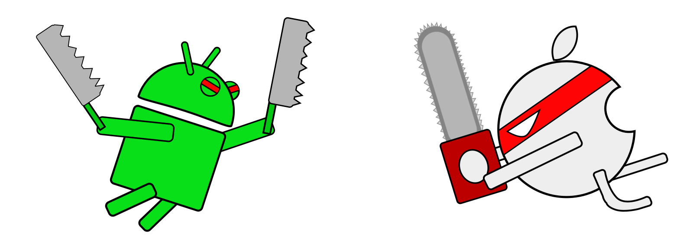

#【对比Android与IOS开发系列】
# ——Activity与UIViewController



## Activity与UIViewController


Android的Activity和Fragment是最基本的界面组成，而IOS是UIViewController。几乎所有的View和空间都会放在Activity和UIViewController中。

在之上有不少扩展的:  

`Android:`  FragmentActivity, AppCompatActivity

`IOS:` UITableViewController, UICollectionViewController

我们对比一下继承关系:
  
`Android:` `Activity->ContextThemeWrapper->ContextWrapper->Context` 
 
`IOS:` `UIViewController->UIResponder->NSObject`

IOS几乎所有的基类都是NSObject，Android中也有Object,一般作为Model层对象的基类。

## 生命周期

这方面资料很多,我简单说一下:

Android的Activity, `onCreate()` 中初始化操作, `onResume()`中可以加一些改变界面和状态的操作;

IOS的UIViewController, `-viewDidLoad ` 中初始化操作, `-viewWillAppear` 中可以加一些改变界面和状态的操作;

对比一下：

> `Activity:` onCreate() --> onStart() --> onResume( )--> `运行态` --> onPause() --> onStop() --> onDestroy()

> `UIViewController:` -viewDidLoad --> -viewWillAppear --> -viewDidAppear --> `运行态` --> -viewWillDisappear --> -viewDidDisappear

这里补充一个Android的  
> `Fragment:`** *onAttach()* --> onCreate() --> *onCreateView()* --> *onActivityCreate()* --> onStart() --> onResume( )--> `运行态` --> onPause() --> onStop() --> *onDestroyView()* --> onDestroy() --> *onDetach()*

Android与IOS都使用 **堆栈** 的数据结构 存储Activity和UIViewController.

`Android`关于Activity的堆栈, 可以搜索`taskAffinity`和`launchMode`。同一应用所有Activity具有相同的亲和性(taskAffinity)，可通过Itent FLAG设置，也可在AndroidManifest中设置.

`IOS`中的UINavigationController通过堆栈来UIViewController.


## 界面跳转与传值

`Android:` Activity可以使用Intent，Fragment使用Bundle。 对于界面回调传值，通过startActivityForResult()启动和onActivityResult()接收。

`IOS:` 在初始化UIViewController对象时，直接给对象中的变量赋值。 对于界面回调传值，可以自定义接口(Delegate),也可以使用通知(Notification)


## 结构类型
 
<h4>类代码</h4>

```
//Android
A.java Class A extends B implements C
```

```
//IOS
A.h @interface A : B 
A.m @implementation A <C>
```
		
--
<h4>强引用和弱引用</h4>


Android:  
>有四种引用类型，强引用(StrongReference),软引用(SoftReference),弱引用(WeakReference),虚引用(Phantom Reference)。  
一般创建的对象都是强引用。所以当内存空间不足时，Java虚拟机宁愿抛出OOM异常，也不会随意回收强引用的对象。  
对于软引用，内存空间足够，垃圾回收器就不会回收它，可以做图片的缓存。  

>对于弱应用，使用场景例如：在Activity中使用Handler时，一方面需要将其定义为静态内部类形式，这样可以使其与外部类（Activity）解耦，不再持有外部类的引用，同时由于Handler中的handlerMessage一般都会多少需要访问或修改Activity的属性，此时，需要在Handler内部定义指向此Activity的WeakReference，使其不会影响到Activity的内存回收同时，可以在正常情况下访问到Activity的属性。


IOS:  
>使用__weak, __strong用来修饰变量，默认声明一个对象 __strong。  
在强引用中，有时会出现循环引用的情况，这时就需要弱引用来帮忙（__weak）。  
强引用持有对象，弱引用不持有对象。  
强引用可以释放对象，但弱引用不可以，因为弱引用不持有对象，当弱引用指向一个强引用所持有的对象时，当强引用将对象释放掉后，弱引用会自动的被赋值为nil，即弱引用会自动的指向nil。

--
<h4>私有和公有</h4>

IOS中有`-``+`方法，`-`相当于Android中的private,   
`+`相当于Android中的public static。  

对于全局变量，IOS是放在AppDelegate中或者使用#define声明在.h中。  
Android同样，放在Application中 或者类中使用public static。  
当然，都可以使用单例类。


## 基本控件

对比一些常用的

Android  | IOS
------------- | -------------
TextView  | UILabel
TextEdit  | UITextField UITextView
ImageView | UIImageView
Button    | UIButton
Switch    | UISwitch
ListView  | TableView 
GridView  | CollectionView

对比一下继承：
Android Views -> View  
IOS Views -> UIView -> UIResponder -> NSObject

Java实际上任何对象都是直接或间接继承自Object，写extends Object和不写extends是等价的。
因此 Android和IOS的对象, 本质上都是从顶级的Object继承来的。*Amazing~*


--
后记  
暂时写这么多，随后再补充。  
这篇只是这个系列的第一篇，随后再写更多。  
文章和代码一样，也需要不断去梳理，不断迭代。  

[](http://www.cnblogs.com/lwbqqyumidi/p/4151833.html)

