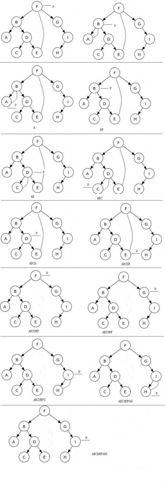

# LeetCode-- Binary Tree Traversal

LeetCode 上二叉树的节点定义如下:  

```
// 树的节点 struct TreeNode {
      int val;
      TreeNode *left;
      TreeNode *right;
      TreeNode(int x) : val(x), left(nullptr), right(nullptr) { }
};
```

常规递归算法

```
/**
 * 递归先序遍历
 */
void preOrder_traverse_recur(BiTree T) {
  if(T == NULL) {
    return;
  } else {
    printf("%d", T->val);
    preOrder_traverse_recur(T->left);
    preOrder_traverse_recur(T->right);
  }
}

/**
 * 递归中序遍历
 */
void inOrder_traverse_recur(BiTree T) {
  if(T == NULL) {
    return;
  } else {
    inOrder_traverse_recur(T->left);
    printf("%d", T->val);
    inOrder_traverse_recur(T->right);
  }
}

/**
 * 递归后序遍历
 */
void postOrder_traverse_recur(BiTree T) {
  if(T == NULL) {
    return;
  } else {
    postOrder_traverse_recur(T->left);
    postOrder_traverse_recur(T->right);
    printf("%d", T->val);
  }
}
```


## Binary Tree Preorder Traversal


## Binary Tree Inorder Traversal


## Binary Tree Postorder Traversal


## Morris算法

参考：[http://www.tuicool.com/articles/zA7NJbj](http://www.tuicool.com/articles/zA7NJbj)



```
算法伪码：

MorrisInOrder()：
while 节点非空
   如果当前节点没有左子树
     访问该节点
     转向右节点
   否则
     找到左子树的最右节点，且使最右节点的右指针指向当前节点
     转向左子树节点

```

C++实现：

```
Morris 中序遍历

void morris_inorder(TreeNode *root) {  
   TreeNode *p = root, *tmp;
   while (p) {  
       if (p->left == NULL) {  
           printf("%d ", p->key);  
           p = p->right;  
       }  
       else {  
           tmp = p->left;  
           while (tmp->right != NULL && tmp->right != p)  
               tmp = tmp->right;  
           if (tmp->right == NULL) {  
               tmp->right = p;  
               p = p->left;  
           } else {  
               printf("%d ", p->key);  
               tmp->right = NULL;  
               p = p->right;  
           }  
       }  
   }  
}
```

```
Morris 先序遍历

void morris_preorder(TreeNode *root) {
	TreeNode *p = root, *tmp;
	while (p) {
		if (p->left == NULL) {
			printf("%d ",p->key);
			p = p->right;
		} else {
			tmp = p->left;
			while (tmp->right != NULL && tmp->right != p) {
				tmp = tmp->right;
			}
			if (tmp->right == NULL){
				print("%d ",p->key);
				tmp->right = p;
				p = p->left;
			} else {
				tmp->right = NULL;
				p = p->right;
			}
		}
	}
}

```


Morris后序遍历二叉树的算法与上面的算法思想一致，只是在遍历前，增加了一个类似头节点的节点作为整个遍历过程的起始节点。

```
/**
 * morris后序遍历算法 
 */
void morris_postOrder(BiTree T) {
  BNode *dump = malloc(sizeof(BNode));
  BNode *p, *temp;
  dump->left = T;
  p = dump;
  while(p) {
    if(p->left == NULL) {
      p = p->right;
    } else {
      temp = p->left;
      while(temp->right != NULL && temp->right != p) {
        temp = temp->right;
      }
      if(temp->right == NULL) {
        temp->right = p;
        p = p->left;
      } else {
        printReverse(p->left, temp);
        temp->right = NULL;
        p = p->right;
      }
    }
  }
  free(dump);
}


```

代码中的printReverse()函数就是逆序遍历从p->left到temp这条路径上的节点的过程;  
printReverse函数先将从from节点到to节点的这条路径反转，再输出，最后还原.

```
/**
 * 相当于单链表的反转
 */
void reverse(BNode *from, BNode *to) {
  BNode *x, *y, *z;
  if(from == to) {
    return;
  }
  x = from;
  y = from->right;
  while(x != to) {
    z = y->right;
    y->right = x;
    x = y;
    y = z;
  }
}

void printReverse(BNode *from , BNode *to) {
  BNode *p;
  reverse(from, to);
  p = to;
  while(1) {
    printf("%4c", p->ch);
    if(p == from) {
      break;
    }
    p = p->right;
  }
  reverse(to, from);
}
```


