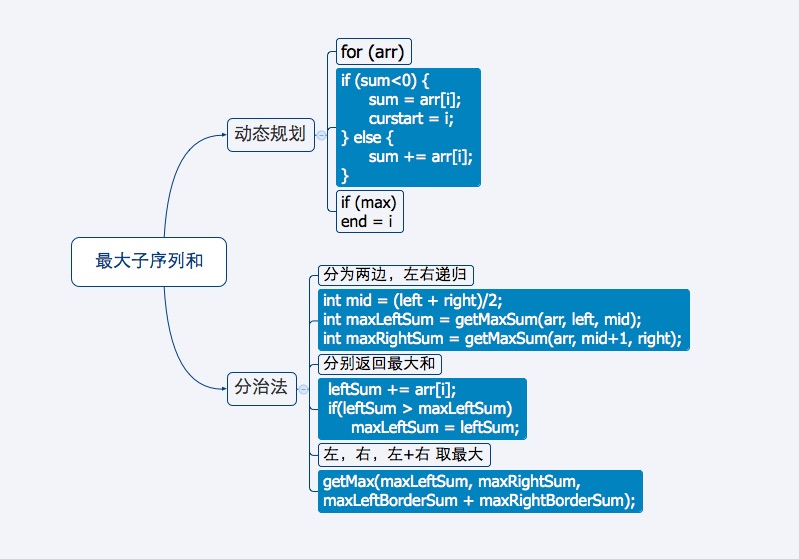
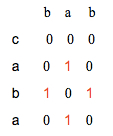
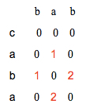
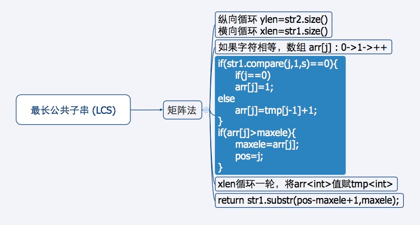
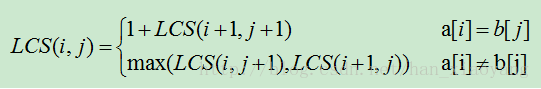
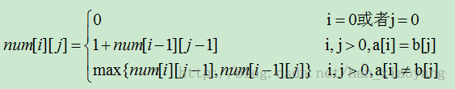
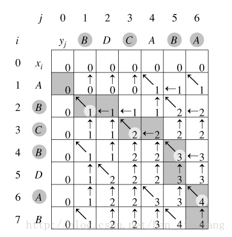

#面试系列 字符串处理算法


## 最大子序列和


### 动态规划法
思路：顺序遍历，判断sum是否大于等于0  
时间复杂度：O(n)  
空间复杂度：O(1)


```
#include <iostream>
#include <limits.h>

using namespace std;

int getMaxSum(int *arr, int size) {
	int maxSum = INT_MIN; //负的无穷大
	int sum = 0;
	int curstart = 0;
	int start = 0;
	int end = 0;
	
	for (int i=0; i<size; i++) {
		if (sum<0) {
			sum = arr[i];
			curstart = i; //记录起始位置
		} else {
			sum += arr[i];
		}
		
		if (sum > maxSum) {
			maxSum = sum;
			start = curstart; //保存起始位置
			end = i; //保存结束为止
		}
	}
	return maxSum;
}


int main(int argc, char *argv[]) {
	
	int arr[] = {0, -2, 3, 5, -1, 2};
	int maxSum = getMaxSum(arr, 6);
	printf("max sum is : %d", maxSum);
	return 0;
}
```

### 分治法
思路：左右分治比中间，递归返回取大小  
时间复杂度：O(n)  
空间复杂度：O(1)

```
#include <iostream>

using namespace std;

int getMax(int a, int b, int c) {
	int max = a;
	if (b > max){
		max = b;
	}
	if (c > max){
		max = c;
	}
	return max;
}

int getMaxSum(int *arr, int left, int right) {
	if (left == right){
		if (arr[left]>0)
			return arr[left];
		else 
			return 0;
	}
	int mid = (left + right)/2;
	int maxLeftSum = getMaxSum(arr, left, mid);
	int maxRightSum = getMaxSum(arr, mid+1, right);
	
	int maxLeftBorderSum = 0, leftBorderSum = 0;
	for (int i= mid; i>=left; i--){
		leftBorderSum += arr[i];
		if(leftBorderSum > maxLeftBorderSum)
			maxLeftBorderSum = leftBorderSum;
	}
	int maxRightBorderSum = 0, rightBorderSum = 0;
	for (int j = mid+1; j<=right; j++){
		rightBorderSum += arr[j];
		if(rightBorderSum>maxRightBorderSum)
			maxRightBorderSum = rightBorderSum;
	}
	return getMax(maxLeftSum, maxRightSum, maxLeftBorderSum + maxRightBorderSum);
	
}

int main(int argc, char *argv[]) {
	int arr[] = {0, -2, 3, 5, -1, 2};
	int maxSum = getMaxSum(arr, 0, 5);
	printf("max sum is : %d", maxSum);
	return 0; 
}
```

## 最长递增子序列 (LIS)


### 动态规划法
思路：i,j循环，存储每个位置的最长递增子序列的长度  
时间复杂度：O(n^2)
空间复杂度：O(n)

```
#include <iostream>

using namespace std;

int len[101];
int maxLen;

int LIS(int *arr, int size) {
	for (int i=0; i<size; ++i) {
		len[i] = 1;
		for (int j=0; j<i; ++j) {
			if (arr[i]>arr[j] && len[i] < len[j]+1){
				len[i] = len[j]+1;
				if(len[i]>maxLen){
					maxLen = len[i];
				}
			}
		}
	}
	return maxLen;
}

void outputLIS(int *arr, int index){
	bool isLIS = 0;
	if (index<0||maxLen==0)
		return;
	if (len[index]==maxLen){
		--maxLen;
		isLIS = 1;
	}
	outputLIS(arr, --index);
	
	if (isLIS)
		printf("%d ", arr[index+1]);
}

int main(int argc, char *argv[]) {
	int arr[] = {1,-1,2,-3,4,-5,6,-7};  
	printf("%d\n",LIS(arr,sizeof(arr)/sizeof(int)));  
	outputLIS(arr,sizeof(arr)/sizeof(int) - 1);  
	printf("\n"); 
}
```


### 动归+二分查找
思路：i循环，存储递增元素至 新的数组  
时间复杂度：O(n)
空间复杂度：O(n)

```
#include <iostream>

using namespace std;

int maxArr[30];
int len;

int BinSearch(int *maxArr, int size, int x) {
	int left = 0, right = size -1;
	while(left<=right){
		int mid = (left+right)/2;
		if (maxArr[mid] <= x){
			left = mid +1;
		} else {
			// right < left maxArr[]覆盖
			right = mid -1;
		}
	}
	return left;
}

int LIS(int *arr, int size) {
	maxArr[0] = arr[0];
	len = 1;
	for (int i=1; i<size; ++i){
		if (arr[i] > maxArr[len-1]){
			maxArr[len] = arr[i];
			len++;
		} else {
			int pos = BinSearch(maxArr, len, arr[i]);
			maxArr[pos] = arr[i];
		}
	}
	return len;
}

int main(int argc, char *argv[]) {
	int arr[] = {1,-1,2,-3,4,-5,6,-7};  
	printf("%d\n",LIS(arr,sizeof(arr)/sizeof(int))); 
	return 0;	
}
```

## 最长公共子串 (LCS)

### 矩阵法
思路：矩阵的对角线，右下依次加一  
时间复杂度：O(n^2)
空间复杂度：O(n)

举个例子 `bab` 和 `caba`, 二维矩阵如下：




我们需要的是某一行和上一行，所以可以用一位数组来代替矩阵。



```
#include<iostream>
#include<cstring>
#include<vector>
using namespace std;
//str1为横向，str2这纵向
const string LCS(const string& str1,const string& str2){
	int xlen=str1.size();       //横向长度
	vector<int> tmp(xlen);      //保存矩阵的上一行
	vector<int> arr(xlen);      //当前行
	int ylen=str2.size();       //纵向长度
	int maxele=0;               //矩阵元素中的最大值
	int pos=0;                  //矩阵元素最大值出现在第几列
	for(int i=0;i<ylen;i++){
		string s=str2.substr(i,1);
		arr.assign(xlen,0);     //数组清0
		for(int j=0;j<xlen;j++){
			if(str1.compare(j,1,s)==0){
				//compare(a,b) //<0:  a < b   
				//=0:  a == b  //>0:  a > b   
				if(j==0)
					arr[j]=1;
				else
					arr[j]=tmp[j-1]+1;
				if(arr[j]>maxele){
					maxele=arr[j];
					pos=j;
				}
			}       
		}
		tmp.assign(arr.begin(),arr.end());
	}
	string res=str1.substr(pos-maxele+1,maxele);
	//substr(a,b):从下标a开始，长度为b
	return res;
}
int main(){
	string str1("21232523311324");
	string str2("312123223445");
	string lcs=LCS(str1,str2);
	cout<<lcs<<endl;
	return 0;
}
```


## 最长公共子序列

### 递归法
思路: i,j标记，a[i]==b[j]分情况，向后递归  
对于a[0...n],b[0..m],   
如果a[i]==b[j], 1+ LCS(i+1,j+1);  
如果a[i]!=b[j], max(LCS(i,j+1),LCS(i+1,j));


时间复杂度：O(n^2)
空间复杂度：O(n)

```
#include<stdio.h>  
#include<string.h>  
char a[100],b[100];  
int lena,lenb;  
int LCS(int,int);///两个参数分别表示数组a的下标和数组b的下标  
int main()  
{  
    strcpy(a,"ABCBDAB");  
    strcpy(b,"BDCABA");  
    lena=strlen(a);  
    lenb=strlen(b);  
    printf("%d\n",LCS(0,0));  
    return 0;  
}  
int LCS(int i,int j)  
{  
    if(i>=lena || j>=lenb)  
        return 0;  
    if(a[i]==b[j])  
        return 1+LCS(i+1,j+1);  
    else  
        return LCS(i+1,j)>LCS(i,j+1)? LCS(i+1,j):LCS(i,j+1);  
}
```

### 动态规划法
思路：矩阵标记，向右、向下、向右下传值
时间复杂度：O(n^2)
空间复杂度：O(n^2)


使用二维数组flag标记下标i和j的走向，数字‘1’表示：斜向下；数字‘2’表示：向右；数字‘3’表示：向下。  

通过行进的路径，可以得到最长公共子序列。

```
#include<stdio.h>  
#include<string.h>  
char a[500],b[500];  
char num[501][501]; ///记录中间结果的数组  
char flag[501][501];    ///标记数组，用于标识下标的走向，构造出公共子序列  
void LCS(); ///动态规划求解  
void getLCS();    ///采用倒推方式求最长公共子序列  
int main()  
{  
	int i;  
	strcpy(a,"ABCBDAB");  
	strcpy(b,"BDCABA");
	LCS();  
	printf("%d\n",num[strlen(a)][strlen(b)]);  
	getLCS();  
	return 0;  
}  
void LCS()  
{  
	int i,j;  
	for(i=1;i<=strlen(a);i++)  
	{  
		for(j=1;j<=strlen(b);j++)  
		{  
			if(a[i-1]==b[j-1])   ///注意这里的下标是i-1与j-1  
			{  
				num[i][j]=num[i-1][j-1]+1;  
				flag[i][j]=1;  ///斜向下标记  
			}  
			else
			{ 
				if(num[i][j-1]>num[i-1][j])  
				{  
					num[i][j]=num[i][j-1];  
					flag[i][j]=2;  ///向右标记  
				}  
				else  
				{  
					num[i][j]=num[i-1][j];  
					flag[i][j]=3;  ///向下标记  
				}
			}  
		}  
	}  
}  
void getLCS()  
{  
	char res[500];  
	int i=strlen(a);  
	int j=strlen(b);  
	int k=0;    ///用于保存结果的数组标志位  
	while(i>0 && j>0)  
	{  
		if(flag[i][j]==1)   ///如果是斜向下标记  
		{  
			res[k]=a[i-1];  
			k++;  
			i--;  
			j--;
		}  
		else if(flag[i][j]==2)  ///如果是斜向右标记  
			j--;  
		else if(flag[i][j]==3)  ///如果是斜向下标记  
			i--;  
	}  
	for(i=k-1;i>=0;i--){  
		printf("%c",res[i]); 	
	}
 
}  
```

## 最长不重复子串

### Hash法
思路：i循环，j=i+1向后循环，通过hash[256]判重  
时间复杂度：O(n^2)  
空间复杂度：O(l)

```
#include <iostream>

using namespace std;

int maxlen;  
int maxindex;  
char visit[256]; 

void output(char * arr){
	for(int i= maxindex; i< maxlen+maxindex; i++){
		printf("%c", arr[i]);
	}
}  
 
void LNRS_hash(char * arr, int size)  
{  
	for(int i = 0; i < size; ++i)  
	{   
		memset(visit,0,sizeof(visit)); //清空hash表，重要
		visit[arr[i]] = 1;  
		for(int j = i+1; j < size; ++j)  
		{  
			if(visit[arr[j]] == 0)  
			{  
				visit[arr[j]] = 1;  
			}  
			else  
			{  
				if(j-i > maxlen)  
				{  
					maxlen = j - i;  
					maxindex = i;  
				}  
				break;  
			}  
		}  
	}  
	output(arr);  
}

int main(int argc, char *argv[]) {
	char arr[11] = "abcabcdcba"; //最后一个为'/0'
	LNRS_hash(arr, 10);
	return 0;
}
```

### 动态规划法
思路：i循环，j=i-1向前循环,判重
时间复杂度：O(n^2)  
空间复杂度：O(n)

```
int dp[100];  
void LNRS_dp(char * arr, int size)  
{  
    int i, j;  
    maxlen = maxindex = 0;  
    dp[0] = 1;  
    for(i = 1; i < size; ++i)  
    {  
        for(j = i-1; j >= 0; --j)  
        {  
            if(arr[j] == arr[i])  
            {  
                dp[i] = i - j;  
                break;  
            }  
        }  
        if(j == -1)  
        {  
            dp[i] = dp[i-1] + 1;  
        }  
        if(dp[i] > maxlen)  
        {  
            maxlen = dp[i];  
            maxindex = i + 1 - maxlen;  
        }  
    }  
    output(arr);  
}
```

### 动归+hash+空间优化
思路：一边遍历，hash记下标  
时间复杂度：O(n)
空间复杂度：O(1)


```
void LNRS_dp_hash(char * arr, int size)  
{  
    memset(visit, -1, sizeof visit);  
    maxlen = maxindex = 0;  
    visit[arr[0]] = 0;  
int curlen = 1;  
    for(int i = 1; i < size; ++i)  
    {  
        if(visit[arr[i]] == -1)  
        {  
            ++curlen;  
            visit[arr[i]] = i; /* 记录字符下标 */  
        }  
else  
        {  
            curlen = i - visit[arr[i]];  
            visit[arr[i]] = i; /* 更新字符下标 */  
        }  
        if(curlen > maxlen)  
        {  
            maxlen = curlen;  
            maxindex = i + 1 - maxlen;  
        }  
    }  
    output(arr);  
}
```


## 最长回文子串
思路：i遍历str,以i为中心，左右两端寻找  
时间复杂度：O(n^2)
空间复杂度：O(1)

```
string findLPS(const string &str)  
{  
    int center = 0, max_len = 0;
    for(int i = 1; i < str.length()-1; ++i)  
    {  
        int j = 1;  
        //以str[i]为中心，依次向两边扩展，寻找最长回文Pi  
        while(i+j < str.length() && i-j >= 0 && str[i+j] == str[i-j])  
            ++j;  
        --j;  
        if(j > 1 && j > max_len)  
        {  
            center = i;  
            max_len = j;  
        }  
    }  
    return str.substr(center-max_len, (max_len * 2) + 1);  
}
```


##### 写在后面的话：
本片博客主要参考 [寒小阳的博客 找工作知识储备(2)](http://blog.csdn.net/han_xiaoyang/article/details/11969497#t15) 对作者表示。  
另外，我会参考更多的资料，整理补充本篇博客。


